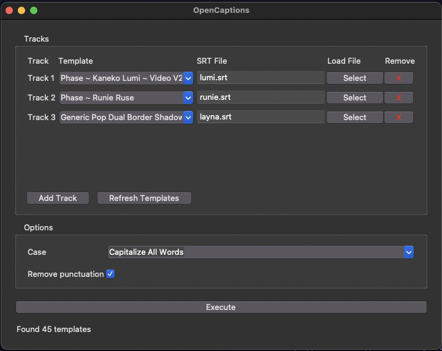

# DaVinci Resolve OpenCaptions
Free & Open-Source subtitle to Text+ tool for DaVinci Resolve. No subscriptions. No paywalls. Just captions that work.

## Description
This is a set of open source tools that uses the DaVinci API to create a Text+ caption track on a DaVinci Timeline from subtitles.

## OpenCaptions

The main tool of the OpenCaptions suite is OpenCaptions, a GUI tool that allows you to create Text+ tracks from SRT files and Text+ templates, and export Text+ tracks back to SRT files. It also has some experimental features for converting Resolve subtitle tracks to Text+ tracks and exporting Resolve subtitle tracks to SRT files.

### Features
- Create Text+ from a .srt file and a Text+ template
- Multi-track support with up to six SRT files with different templates, each generating its own Text+ track
- Export Text+ timeline tracks back to .srt files
- Convert Resolve subtitle tracks into Text+ tracks using templates (experimental)
- Export Resolve subtitle tracks back to .srt files (experimental)
- Remove punctuation (optional)
- Case conversion [none, lower case, upper case, capitalize all words]

### Usage

1. Create a "Captions Templates" folder in your Media Pool. 
2. Place your Text+ templates in it.
3. Write or generate your subtitles track.
4. Export your subtitle track to a .srt file. (skip this step if you created the subtitles outside of DaVinci Resolve)
5. Run OpenCaptions from the Resolve Workspace menu. `Workspace -> Scripts -> Comp -> OpenCaptions`
6. Select up to five SRT/template pairs.
7. Click "Execute"; tracks are generated in order.

### Notes

- OpenCaptions always works with the focused timeline, no need to restart it when you change the timeline.
- OpenCaptions will always create a new Text+ track, it will not overwrite existing Text+ tracks.

## OpenCaptions Auto

OpenCaptionsAuto is a small script that allow to convert subtitle tracks to Text+ tracks using text+ templates. 
No GUI, no options, just a quick and easy way to convert a subtitle tracks to Text+ tracks.

Simply name the subtitle track the same as the Text+ template you want to use, and when running OpenCaptionsAuto, it will convert all subtitle tracks to Text+ tracks.

## OpenCaptions Studio

OpenCaptions Studio is a GUI to help convert a subtitle track to a Text+ track using a Text+ template, it allow to fix the timing of the subtitle track as you go through the subtitles.
The best options if you use Davinci Resolve Studio `subtitle from audio` feature that generate badly timed subtitle tracks.

Demo video:

## Install
1. Install [DaVinci Resolve](https://www.blackmagicdesign.com/products/davinciresolve) 19 or higher.
2. Install [Python](https://www.python.org/downloads/) 3.10 or higher.
3. Install OpenCaptions by placing the "OpenCaptions.py" file in the following folder:
    
    On Windows 
    > C:\ProgramData\Blackmagic Design\DaVinci Resolve\Fusion\Scripts\Comp\
    
    On MacOS  
    > /Library/Application Support/Blackmagic Design/DaVinci Resolve/Fusion/Scripts/Comp/

## Why Use OpenCaptions?
- Simple to use
- Totally free
- Totally open source, you can audit the code, and make your own changes
- Cross-platform, you can use it on Windows, macOS, and Linux
- Compatible with both DaVinci Resolve Free and DaVinci Resolve Studio (paid)

## Dependencies
- Davinci Resolve 19 or higher
- Python 3.10+
- tkinter (standard library)

## About

### Why the name "OpenCaptions"?
"Open" because it's open source  
"Captions" because it works on subtitles and captions  
And open captions are the name for subtitles burned directly into a video. Since we convert closed captions from SRT to Text+ to be burned in as open captions, it's a fitting name.

### Why make it?
The starting point of OpenCaptions is based on one of my older projects, [Resolve_TextPlus2SRT](https://github.com/david-ca6/Resolve_TextPlus2SRT).  
But TextPlus2SRT was more a custom script for my own use than anything else; it was missing a lot of features, it only worked with Linux, required typing in a terminal, and it only allowed converting SRT to Text+, nothing more. OpenCaptions is intended to be a stronger base to work from to make a more powerful and user-friendly tool.

## Disclaimer about experimental features
> The OpenCaptionsAuto script, OpenCaptionsMini, OpenCaptionsStudio subtitle to Text+ conversion, and OpenCaptionsStudio subtitle export rely on a bug in the DaVinci Resolve API that allows reading the subtitle text from the subtitle name field. If that bug gets fixed, all plugins that convert subtitle tracks to Text+ will break. Using OpenCaptionsStudio with an SRT file is more reliable long term.
